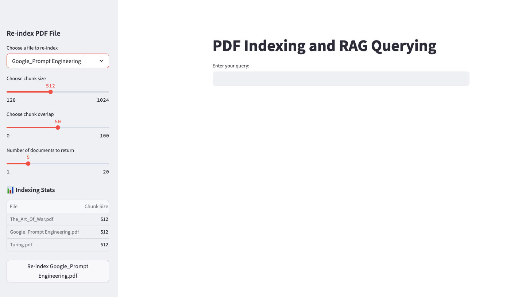
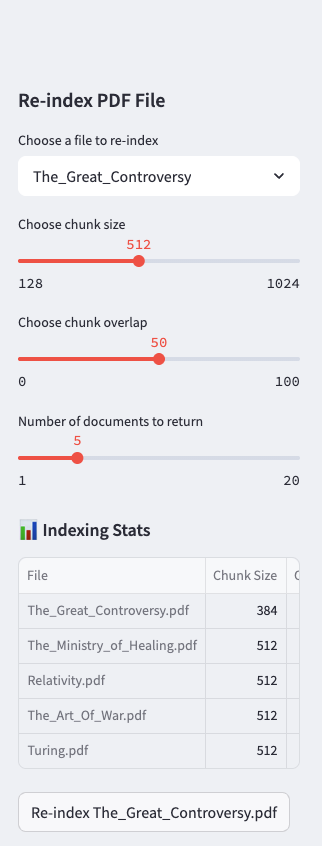

# DocAnatomyDemo - Intelligent Document Processing

[](https://www.python.org/downloads/)
[](https://opensource.org/licenses/MIT)
[](https://streamlit.io)
[](https://creativecommons.org/share-your-work/public-domain/)

## 📚 Project Description

DocAnatomyDemo is a **Retrieval-Augmented Generation (RAG) system** that transforms document collections into queryable knowledge bases. The application includes a curated library of public domain texts across multiple disciplines:

### Included Public Domain Texts
| Title | Author | Domain |
|-------|--------|--------|
| Computing Machinery and Intelligence | A.M. Turing | Computer Science |
| The Art of War | Sun Tzu | Military Strategy |
| Prompt Engineering|Lee Boonstra|Computer Science/A.I.


## 🖥️ Core Interface

<div align="center">
  
  <p><em>Search across documents with natural language queries</em></p>
</div>

## 🔍 Sample Queries you can try with the sample indexed PDF files.

<div align="center">
  
  <p><em>Precise answers with source citations</em></p>
  
  **Try This**:  
  ## The Art of War (Simple RAG Questions)

- What is "The Art of War" mainly about?
- Why does Sun Tzu say it’s important to plan before a battle?
- What does Sun Tzu say about tricking your enemies?
- How should a leader treat their soldiers, according to Sun Tzu?
- What does "knowing yourself and knowing your enemy" mean?
- Why does Sun Tzu believe it’s better to win without fighting?
- What does Sun Tzu say about choosing the right time and place to fight?
- How important is speed in winning a battle, according to Sun Tzu?
- What lessons from "The Art of War" can you use in everyday life?

## Computing Machinery and Intelligence (Sample RAG Questions)

- What is the main question Turing asks in "Computing Machinery and Intelligence"?
- What is the Turing Test and why is it important?
- How does Turing address objections to machine intelligence?
- What examples does Turing use to show that machines could think?
- What is Turing's view on whether machines can make mistakes?
- Why does Turing compare human learning to machine learning?
- How does Turing respond to the idea that machines cannot have consciousness?
- What role does imitation play in Turing’s argument?
- How has Turing’s paper influenced modern AI?

## Prompt Engineering at Lee Boonstra (Google White Paper) (Sample RAG Questions)

- What is prompt engineering according to the Google white paper?
- Why is prompt engineering important when working with LLMs?
- What are examples of good and bad prompts?
- How can prompt tuning improve LLM performance?
- What strategies are recommended for designing effective prompts?
- How does task-specific prompting differ from general prompting?
- What are the limitations of prompt engineering mentioned in the paper?
- How can prompt engineering reduce hallucinations in LLM outputs?
- Why is understanding prompt behavior critical for building reliable AI applications?


</div>

## ⚙️ Configuration Panel

<div align="center">
  
  <p><em>Optimize retrieval with live parameter adjustment</em></p>
  
  **Key Settings**:
  - Chunk Size: 128-1024 characters  
  - Overlap: 10-25% of chunk size  
  - Top-K Results: 3-10 documents  
</div>


## Features


- **Document Intelligence**: 
  - PDF parsing with configurable chunking (128-1024 chars)
  - Semantic search powered by FAISS
  - Metadata-preserving processing pipeline

- **AI Integration**:
  - Gemini 2.0 Flash for RAG responses
  - Hallucination-resistant output formatting
  - Context-aware summarization

- **Operational Tools**:
  - Dynamic re-indexing
  - Performance statistics tracking
  - Sample document suite for testing

## Quick Start

```bash
# 1. Clone and setup
git clone https://github.com/yourusername/DocAnatomyDemo.git
cd DocAnatomyDemo

# 2. Set up environment (Python 3.10 required)
python -m venv .venv
source .venv/bin/activate  # Linux/Mac
# .venv\Scripts\activate  # Windows

# 3. Install dependencies
pip install -r requirements.txt

# 4. Launch application
streamlit run main.py
```

## 🚀 Future Roadmap

### Core Improvements
| Priority | Feature | Description |
|----------|---------|-------------|
| 🔴 High | **Text Cleaning Pipeline** | Advanced preprocessing for encoding issues (UTF-8 normalization, OCR artifact removal) |
| 🟠 Medium | **RAG Evaluation Suite** | Metrics for retrieval accuracy (Precision@K, MRR) and answer faithfulness |
| 🟢 Low | **Document Upload** | Drag-and-drop interface for user-provided PDFs |


### Extended Capabilities

**Planned Integrations:**

- **File Types:**
  - json
  - csv
  - docx
  - pptx
- **Multimodal:**
  - Image OCR extraction
  - Chart data parsing
  - Audio transcription indexing


## 💬 Contact Lewis Blackwell

<div align="center" style="margin: 1.5rem 0;">

[](mailto:leblackwell.nlp@gmail.com)
[](https://github.com/yourusername/DocAnatomyDemo/issues)

</div>

**I welcome communication about**:
- Usage questions
- Bug reports
- Feature suggestions