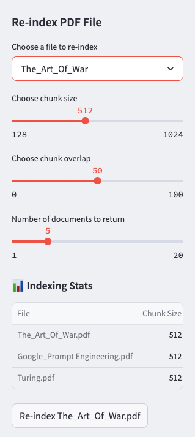

# DocAnatomyDemo - Intelligent Document Processing

[](https://www.python.org/downloads/)
[](https://opensource.org/licenses/MIT)
[](https://streamlit.io)
[](https://creativecommons.org/share-your-work/public-domain/)

## 📚 Project Description

DocAnatomyDemo is a **Retrieval-Augmented Generation (RAG) system** that transforms document collections into queryable knowledge bases. The application includes a curated library of public domain texts across multiple disciplines:

### Included Public Domain Texts
| Title | Author | Domain |
|-------|--------|--------|
| Computing Machinery and Intelligence | A.M. Turing | Computer Science |
| The Art of War | Sun Tzu | Military Strategy |
| Ministry of Healing | E.G. White | Health Sciences |
| The Great Controversy | E.G. White | Theology |

**Sample Cross-Disciplinary Queries**:
```python
"Explain Turing's arguments about machine consciousness"
"Compare Sun Tzu's strategies to modern cybersecurity principles"
"What health guidelines from Ministry of Healing remain relevant today?"

## 🖼️ Application Screenshots

<div align="center">

### Re-indexing Controls

<em>Adjust document processing parameters in real-time</em>

### Main Search Interface  

<em>Natural language search across document collections</em>

### Turing Paper Query Example
  
<em>Retrieving precise answers from technical papers</em>

</div>


## Features


- **Document Intelligence**: 
  - PDF parsing with configurable chunking (128-1024 chars)
  - Semantic search powered by FAISS
  - Metadata-preserving processing pipeline

- **AI Integration**:
  - Gemini 2.0 Flash for RAG responses
  - Hallucination-resistant output formatting
  - Context-aware summarization

- **Operational Tools**:
  - Dynamic re-indexing
  - Performance statistics tracking
  - Sample document suite for testing

## Quick Start

```bash
# 1. Clone and setup
git clone https://github.com/yourusername/DocAnatomyDemo.git
cd DocAnatomyDemo

# 2. Set up environment (Python 3.10 required)
python -m venv .venv
source .venv/bin/activate  # Linux/Mac
# .venv\Scripts\activate  # Windows

# 3. Install dependencies
pip install -r requirements.txt

# 4. Launch application
streamlit run main.py